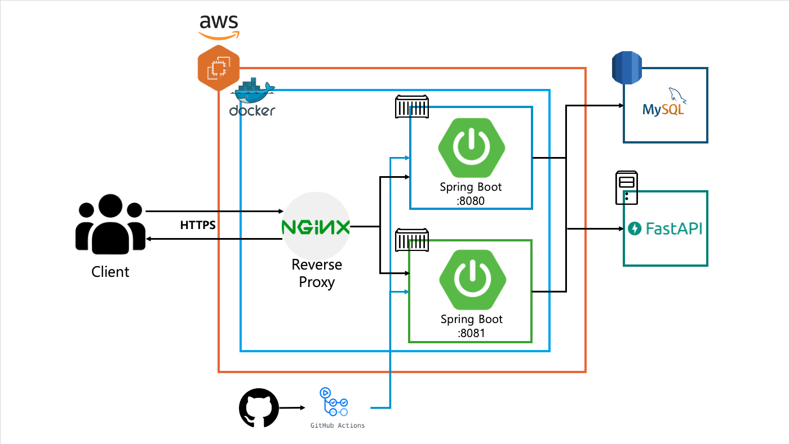
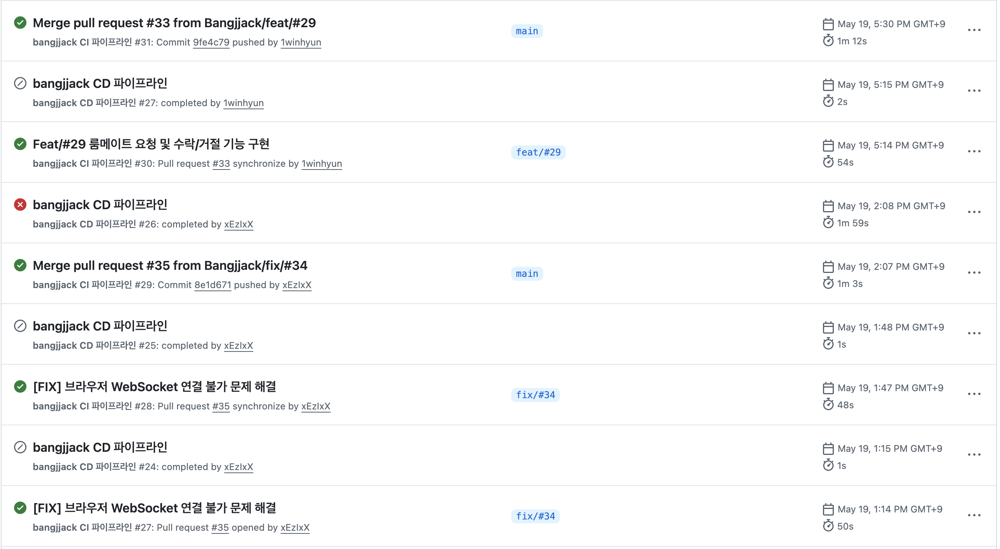
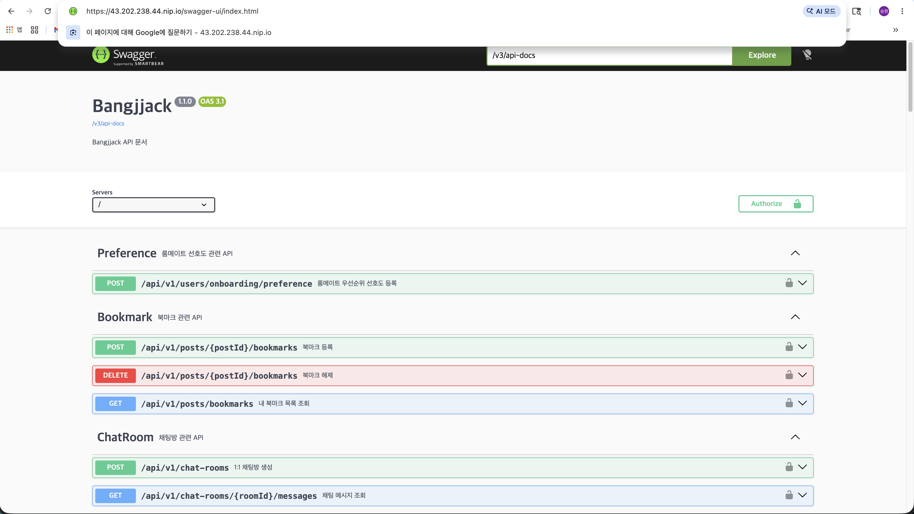

# 3주차 과제

## 1. 졸업 프로젝트 시스템 아키텍처


## 2. 인스턴스 및 RDS 생성
### 인스턴스 생성 완료. (인스턴스 스펙: t3.micro)


### RDS 생성 완료.


## 3. 인스턴스 내 블루/그린 무중단 배포 스크립트 deploy.sh 작성

```bash
#!/bin/bash

# 환경 변수
HOST_NGINX_CONF_DIR=/home/ubuntu/nginx/conf.d
NGINX_DEFAULT_CONF="${HOST_NGINX_CONF_DIR}/default.conf"
DOCKER_CONTAINER_NAME_PREFIX=bangjjack
INTERNAL_PORT=8080
DOCKER_IMAGE_NAME=hanseunghyun0615/bangjjack:latest
DOCKER_COMPOSE_FILE="docker-compose.yaml"

# 네트워크 확인 및 생성
if ! docker network ls | grep -q bangjjack; then
  echo "Creating the bangjjack Docker network..."
  docker network create bangjjack
else
  echo "Docker network 'bangjjack' already exists."
fi

# 최신 이미지 pull
docker pull $DOCKER_IMAGE_NAME

# nginx 컨테이너 확인
IS_NGINX_RUNNING=$(docker compose -f $DOCKER_COMPOSE_FILE ps -q nginx)
if [ -z "$IS_NGINX_RUNNING" ]; then
  echo "Nginx container is not running. Starting nginx container..."
  docker compose -f $DOCKER_COMPOSE_FILE up -d nginx
  sleep 3
else
  echo "Nginx container is already running."
fi

# 현재 실행 중인 컨테이너 확인
IS_BLUE_RUNNING=$(docker compose -f $DOCKER_COMPOSE_FILE ps -q ${DOCKER_CONTAINER_NAME_PREFIX}-blue)

if [ -n "$IS_BLUE_RUNNING" ]; then
  echo "Switching to green environment..."
  docker compose -f $DOCKER_COMPOSE_FILE rm -f ${DOCKER_CONTAINER_NAME_PREFIX}-green
  docker compose -f $DOCKER_COMPOSE_FILE up -d ${DOCKER_CONTAINER_NAME_PREFIX}-green
  BEFORE_COLOR=blue
  AFTER_COLOR=green
else
  echo "Switching to blue environment..."
  docker compose -f $DOCKER_COMPOSE_FILE rm -f ${DOCKER_CONTAINER_NAME_PREFIX}-blue
  docker compose -f $DOCKER_COMPOSE_FILE up -d ${DOCKER_CONTAINER_NAME_PREFIX}-blue
  BEFORE_COLOR=green
  AFTER_COLOR=blue
fi

sleep 3

# Health Check
echo "Starting health check..."

TARGET="${DOCKER_CONTAINER_NAME_PREFIX}-${AFTER_COLOR}:${INTERNAL_PORT}"
MAX_TRIES=60
SLEEP_SECS=3

for i in $(seq 1 ${MAX_TRIES}); do
  OUT=$(docker compose -f "$DOCKER_COMPOSE_FILE" exec -T nginx sh -lc \
    "curl -m 3 -sS -w ' HTTP_CODE:%{http_code}' http://${TARGET}/actuator/health" 2>&1 || true)

  echo "[try ${i}] ${OUT}"

  echo "${OUT}" | grep -q 'HTTP_CODE:200' || { sleep ${SLEEP_SECS}; continue; }

  if echo "${OUT}" | grep -q '"status":"UP"'; then
    echo "> Health check successful!"
    
    # nginx upstream 갈아끼우기
    sed -i -E "/upstream[[:space:]]+api[[:space:]]*\{/,/\}/ s|^[[:space:]]*server[[:space:]].*;|        server ${DOCKER_CONTAINER_NAME_PREFIX}-${AFTER_COLOR}:${INTERNAL_PORT};|" "$NGINX_DEFAULT_CONF"

    docker compose -f $DOCKER_COMPOSE_FILE exec -T nginx nginx -t
    docker compose -f $DOCKER_COMPOSE_FILE exec -T nginx nginx -s reload

    sleep 5

    docker compose -f $DOCKER_COMPOSE_FILE stop ${DOCKER_CONTAINER_NAME_PREFIX}-${BEFORE_COLOR}
    docker compose -f $DOCKER_COMPOSE_FILE rm -f ${DOCKER_CONTAINER_NAME_PREFIX}-${BEFORE_COLOR}
    echo "${BEFORE_COLOR} environment is down."

    docker image prune -a -f

    echo "Deployment successful!"
    exit 0
  fi
done

# Health check 실패 시 롤백
echo "Health check failed. Rolling back..."
docker compose -f $DOCKER_COMPOSE_FILE stop ${DOCKER_CONTAINER_NAME_PREFIX}-${AFTER_COLOR}
docker compose -f $DOCKER_COMPOSE_FILE rm -f ${DOCKER_CONTAINER_NAME_PREFIX}-${AFTER_COLOR}
echo "The previous container remains active."
exit 1
```

#### 스크립트 동작 설명

이 스크립트는 Docker Compose와 Nginx를 활용해 **블루/그린(Blue/Green) 무중단 배포**를 수행한다. 새 버전의 컨테이너를 먼저 띄워 헬스체크를 통과시킨 뒤, Nginx의 upstream을 새 컨테이너로 전환하여 서비스 중단 없이 배포를 완료한다.

##### 1) 환경 변수 정의
- `HOST_NGINX_CONF_DIR`, `NGINX_DEFAULT_CONF`: 호스트에 마운트된 Nginx 설정 파일 경로
- `DOCKER_CONTAINER_NAME_PREFIX`: 블루/그린 컨테이너에 공통으로 붙는 접두사 (`bangjjack-blue`, `bangjjack-green`)
- `INTERNAL_PORT`: 애플리케이션 컨테이너 내부 포트 (Spring Boot 기본 8080)
- `DOCKER_IMAGE_NAME`: Docker Hub에서 pull할 최신 이미지
- `DOCKER_COMPOSE_FILE`: 사용할 compose 파일

##### 2) 네트워크 및 Nginx 사전 준비
- `bangjjack` Docker 네트워크가 없으면 새로 생성한다. Nginx와 앱 컨테이너가 컨테이너 이름으로 통신하려면 동일한 사용자 정의 네트워크에 속해 있어야 한다.
- 최신 이미지를 `docker pull`로 받아온다.
- Nginx 컨테이너가 떠 있지 않다면 먼저 기동한다. Nginx는 블루/그린 전환과 관계없이 항상 동일하게 유지되는 **상시 컨테이너**다.

##### 3) 현재 활성 환경 판별
- `bangjjack-blue` 컨테이너의 실행 여부로 현재 활성 색상을 판정한다.
  - blue가 떠 있으면 → 신규 배포는 **green**으로 진행
  - blue가 없으면 → 신규 배포는 **blue**로 진행
- `BEFORE_COLOR`(이전), `AFTER_COLOR`(새로 띄울 컨테이너) 변수에 저장하여 이후 단계에서 사용한다.
- 신규 색상 컨테이너는 `rm -f`로 잔재를 제거한 뒤 `up -d`로 새 이미지로 기동한다.

##### 4) 헬스체크 (Health Check)
- 최대 `MAX_TRIES(60)`회, `SLEEP_SECS(3초)` 간격으로 새로 띄운 컨테이너의 `/actuator/health` 엔드포인트를 호출한다 (총 약 3분).
- 호출은 **Nginx 컨테이너 내부에서 `docker compose exec`로 실행**한다. 이렇게 하면 Nginx와 동일한 Docker 네트워크 컨텍스트에서 `bangjjack-green:8080` 같은 컨테이너 이름을 그대로 사용할 수 있어 호스트 포트 노출이 필요 없다.
- 응답이 `HTTP 200`이고 본문에 `"status":"UP"`이 포함되면 헬스체크 성공으로 판정한다.

##### 5) Nginx upstream 전환 (트래픽 스위칭)
- 헬스체크가 통과되면 `sed`로 `default.conf`의 `upstream api { ... }` 블록 내부 `server` 지시문을 새 컨테이너 주소로 치환한다.
- `nginx -t`로 설정 문법을 검증한 뒤 `nginx -s reload`로 무중단 리로드를 수행한다. 이 시점부터 모든 신규 요청은 새 컨테이너로 향한다.
- `reload`는 기존 워커를 graceful하게 종료하므로 진행 중인 요청도 끊기지 않는다.

##### 6) 이전 컨테이너 정리
- 트래픽 전환이 끝나면 `sleep 5`로 잔여 요청 처리를 대기한 후, 이전 색상 컨테이너를 `stop` → `rm`으로 제거한다.
- `docker image prune -a -f`로 사용하지 않는 이미지를 정리해 디스크 공간을 확보한다.

##### 7) 롤백 처리
- 헬스체크가 모든 시도 동안 실패하면 새로 띄운 컨테이너를 내리고 종료 코드 `1`을 반환한다.
- Nginx upstream은 아직 변경되지 않은 상태이므로 **이전 컨테이너가 그대로 트래픽을 처리**하며, 서비스 중단 없이 자동 롤백된다.

##### 핵심 포인트
- 새 컨테이너가 **정상 동작을 검증받기 전에는 트래픽이 라우팅되지 않는다** → 무중단 보장
- 실패 시 이전 컨테이너가 살아 있어 자동 롤백이 가능하다
- Nginx는 항상 떠 있고, upstream 설정만 갈아끼우므로 LB 자체의 다운타임이 없다

## 4. 프로젝트 내 CI/CD 구축
### ci.yaml 파일 작성

```yaml
name: bangjjack CI 파이프라인

on:
  push:
    branches: [ "main" ]
  pull_request:
    branches: [ "main" ]

permissions:
  contents: read

jobs:
  test:
    runs-on: ubuntu-latest

    steps:
      - name: Checkout code
        uses: actions/checkout@v6

      - name: Set up JDK 21
        uses: actions/setup-java@v5
        with:
          java-version: '21'
          distribution: 'temurin'

      - name: Setup Gradle
        uses: gradle/actions/setup-gradle@v5
        with:
          gradle-version: wrapper
          cache-read-only: ${{ github.ref != 'refs/heads/main' && github.ref != 'refs/heads/dev' }}

      - name: Grant execute permission for gradlew
        run: chmod +x gradlew

      - name: Run Tests
        run: ./gradlew test
```

##### 1) 트리거 (on)
- `push: main`: main 브랜치에 직접 푸시될 때 실행
- `pull_request: main`: main 브랜치를 대상으로 하는 PR이 열리거나 갱신될 때 실행
- PR 단계에서 미리 테스트가 실행되므로, **머지 전에 빌드/테스트 실패를 잡아낼 수 있다.**

##### 2) 권한 설정 (permissions)
- `contents: read`: 워크플로우에 **저장소 읽기 권한만** 부여한다.
- GitHub Actions의 `GITHUB_TOKEN`은 기본적으로 광범위한 권한을 가지므로, 최소 권한 원칙(Least Privilege)에 따라 명시적으로 축소한다.

##### 3) 실행 환경 (jobs.test)
- `runs-on: ubuntu-latest`: GitHub가 제공하는 최신 Ubuntu 러너에서 실행한다.
- `test`라는 단일 job 안에서 모든 단계를 순차적으로 수행한다.

##### 4) 단계별 동작 (steps)

**① Checkout code (`actions/checkout@v6`)**
- 워크플로우가 실행되는 러너에 저장소 코드를 클론한다.
- 이 단계가 없으면 이후 단계에서 소스 코드에 접근할 수 없다.

**② Set up JDK 21 (`actions/setup-java@v5`)**
- 프로젝트가 사용하는 **Java 21 (Temurin 배포판)** 을 러너에 설치한다.
- Temurin은 Eclipse Adoptium에서 제공하는 OpenJDK 빌드로, 안정성과 LTS 지원이 검증되어 있다.

**③ Setup Gradle (`gradle/actions/setup-gradle@v5`)**
- `gradle-version: wrapper`: 프로젝트의 `gradle/wrapper/gradle-wrapper.properties`에 명시된 Gradle 버전을 사용하여 **로컬 개발 환경과 CI의 Gradle 버전을 일치시킨다.**
- `cache-read-only`: main/dev 브랜치에서만 Gradle 캐시를 **쓰기 가능**으로 설정하고, 그 외 브랜치(PR 포함)에서는 **읽기 전용**으로 동작한다. 이는 PR마다 캐시를 새로 쓰면서 발생하는 캐시 오염을 방지하고, 안정적인 브랜치에서만 캐시를 갱신하기 위한 전략이다.

**④ Grant execute permission for gradlew**
- `chmod +x gradlew`로 Gradle Wrapper 스크립트에 실행 권한을 부여한다.
- Windows에서 커밋된 파일이거나 권한 비트가 누락된 경우 `Permission denied` 에러가 발생할 수 있어 사전에 처리한다.

**⑤ Run Tests**
- `./gradlew test`로 프로젝트의 전체 테스트 스위트를 실행한다.
- 테스트가 하나라도 실패하면 워크플로우가 실패 처리되며, **PR에는 실패 표시가 남아 머지를 차단**할 수 있다.

### cd.yaml 파일 작성

```yaml
name: bangjjack CD 파이프라인

on:
  workflow_run:
    workflows: [ "bangjjack CI 파이프라인" ]
    types:
      - completed

jobs:
  deploy:
    if: >
      github.event.workflow_run.conclusion == 'success' &&
      github.event.workflow_run.event == 'push' &&
      github.event.workflow_run.head_branch == 'main' &&
      github.event.workflow_run.head_repository.full_name == github.repository

    runs-on: ubuntu-latest
    permissions:
      contents: read

    steps:
      - name: Checkout code
        uses: actions/checkout@v6

      - name: Set up JDK 21
        uses: actions/setup-java@v5
        with:
          java-version: '21'
          distribution: 'temurin'

      - name: Setup Gradle
        uses: gradle/actions/setup-gradle@v5
        with:
          gradle-version: wrapper
          cache-read-only: false

      - name: Grant execute permission for gradlew
        run: chmod +x gradlew

      - name: Build bootJar
        run: ./gradlew bootJar

      - name: 도커 로그인
        uses: docker/login-action@v3
        with:
          username: ${{ secrets.DOCKER_USERNAME }}
          password: ${{ secrets.DOCKER_ACCESS_TOKEN }}

      - name: Set up Docker Buildx
        uses: docker/setup-buildx-action@v3

      - name: 이미지 빌드 및 푸시
        uses: docker/build-push-action@v6
        with:
          context: .
          file: ./Dockerfile
          platforms: linux/amd64
          tags: ${{ secrets.DOCKER_USERNAME }}/bangjjack:latest
          push: true
          cache-from: type=gha
          cache-to: type=gha,mode=max

      - name: Docker 이미지 prod 서버 배포
        uses: appleboy/ssh-action@master
        with:
          host: ${{secrets.PROD_HOST}}
          username: ${{secrets.PROD_USERNAME}}
          key: ${{secrets.PROD_KEY}}
          script: |
            docker pull ${{secrets.DOCKER_USERNAME}}/bangjjack:latest
            chmod +x ~/deploy.sh
            sudo ~/deploy.sh
```

#### CD 파이프라인 동작 설명

이 워크플로우는 **CI 파이프라인이 성공적으로 완료된 후**에만 트리거되어, Docker 이미지를 빌드/푸시한 뒤 EC2 서버에 SSH로 접속하여 `deploy.sh`(블루/그린 배포 스크립트)를 실행한다. CI와 CD를 분리함으로써 **테스트가 통과하지 않은 코드는 절대 배포되지 않도록** 보장한다.

##### 1) 트리거 (on.workflow_run)
- `workflows: [ "bangjjack CI 파이프라인" ]`: CI 워크플로우의 실행이 끝났을 때 자동으로 트리거된다.
- `types: [completed]`: 성공/실패 여부와 관계없이 CI가 종료되는 모든 시점에 이벤트가 발생하며, 실제 실행 여부는 아래 `if` 조건에서 거른다.
- **CI → CD 체이닝 구조**로, 단일 워크플로우에 모든 단계를 몰아넣지 않고 책임을 분리한다.

##### 2) 실행 조건 (jobs.deploy.if)
네 가지 조건을 **AND**로 결합하여 안전장치를 둔다.
- `conclusion == 'success'`: CI 워크플로우가 **성공**했을 때만 실행 → 테스트 실패 시 배포 차단
- `event == 'push'`: PR이 아닌 **실제 push 이벤트**로 트리거된 CI에 대해서만 동작 → PR 단계에서는 배포되지 않음
- `head_branch == 'main'`: **main 브랜치**에 대한 변경에 대해서만 배포
- `head_repository.full_name == github.repository`: **외부 fork**에서 발생한 워크플로우는 차단 → 악의적인 PR이 prod 시크릿에 접근하는 것을 방지

##### 3) 권한 설정 (permissions)
- `contents: read`: 저장소 읽기 권한만 허용. 시크릿은 별도로 관리되므로 토큰 권한은 최소로 유지한다.

##### 4) 단계별 동작 (steps)

**① Checkout & JDK & Gradle 설정**
- CI와 동일하게 코드를 체크아웃하고 Java 21 + Gradle Wrapper 환경을 구성한다.

**② Build bootJar**
- `./gradlew bootJar`로 Spring Boot 실행 가능한 JAR 파일을 빌드한다.
- 이 JAR이 다음 단계에서 Docker 이미지에 포함될 산출물이 된다.

**③ 도커 로그인 (`docker/login-action@v3`)**
- `secrets.DOCKER_USERNAME`, `secrets.DOCKER_ACCESS_TOKEN`을 사용해 Docker Hub에 로그인한다.

**④ Set up Docker Buildx (`docker/setup-buildx-action@v3`)**
- Docker의 빌더 **Buildx**를 셋업한다.

**⑤ 이미지 빌드 및 푸시 (`docker/build-push-action@v6`)**
- `platforms: linux/amd64`: EC2(Ubuntu/Intel)에서 동작할 아키텍처로 지정.
- `tags: .../bangjjack:latest`: Docker Hub에 `latest` 태그로 푸시. 서버에서는 항상 `latest`를 pull하므로 이 태그가 곧 배포 대상이 된다.
- `cache-from/to: type=gha`: **GitHub Actions 캐시**를 Docker 레이어 캐시로 활용. `mode=max`는 중간 레이어까지 모두 캐시하여 다음 빌드의 속도를 극대화한다.

**⑥ prod 서버 배포 (`appleboy/ssh-action@master`)**
- `secrets.PROD_HOST`, `PROD_USERNAME`, `PROD_KEY`로 EC2 인스턴스에 SSH 접속한다.
- `PROD_KEY`는 EC2 키페어의 **private key**이며, GitHub Secrets에 안전하게 저장된다.
- 접속 후 실행되는 명령:
  1. `docker pull .../bangjjack:latest` — 새 이미지를 미리 받아둔다.
  2. `chmod +x ~/deploy.sh` — 배포 스크립트에 실행 권한 부여.
  3. `sudo ~/deploy.sh` — 앞서 작성한 **블루/그린 무중단 배포 스크립트**를 실행한다.

##### 전체 흐름 요약
```
개발자 push (main)
   ↓
CI 워크플로우 (테스트)
   ↓ 성공 시
CD 워크플로우 트리거
   ↓
bootJar 빌드 → Docker 이미지 빌드 & 푸시
   ↓
EC2 SSH 접속 → deploy.sh 실행
   ↓
블루/그린 컨테이너 전환 → 무중단 배포 완료
```

## 5. CI/CD 서버 배포 성공 및 서버 접속 성공

