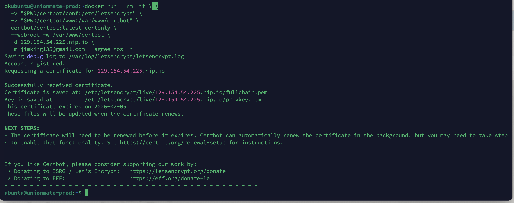

# Nginx 리버스 프록시 + Certbot(Https 적용) 배포 가이드

---

## 1. 기본 구성 (HTTP)

### 1-1. `docker-compose.yml` 작성

```yaml
services:
  unionmate-dev:
    image: your-docker-id/your-app:latest   # <- 본인의 스프링 이미지로 교체
    container_name: unionmate-dev
    ports:
      - "8080:8080"
    environment:
      - SPRING_PROFILES_ACTIVE=prod
    restart: always

  nginx:
    image: nginx:latest
    container_name: nginx
    depends_on:
      - unionmate-dev
    ports:
      - "80:80"
      # - "443:443"       # TLS 쓸 거면 주석 해제 (아래 2번 참고)
    volumes:
      - ./nginx/conf.d:/etc/nginx/conf.d:ro
      - ./nginx/logs:/var/log/nginx
    restart: always
```

### 1-2. `nginx/conf.d/default.conf` 작성

```nginx
server {
    listen 80;
    server_name _;                 # 도메인이 있으면 도메인으로 변경
    client_max_body_size 10m;      # 업로드 크기 필요시 조정

    location / {
        proxy_pass         http://unionmate-prod:8080;  # 서비스 이름으로 바로 연결
        proxy_set_header   Host $host;
        proxy_set_header   X-Real-IP $remote_addr;
        proxy_set_header   X-Forwarded-For $proxy_add_x_forwarded_for;
        proxy_set_header   X-Forwarded-Proto $scheme;
    }

    location /nginx/health {
        access_log off;
        return 200 'ok';
        add_header Content-Type text/plain;
    }
}
```

> **저장이 안 될 때**
> 호스트(EC2)의 `~/nginx/conf.d` 폴더에 쓸 권한이 없어서 생기는 문제입니다.
> 아래 명령으로 권한을 부여한 뒤 다시 작성하세요.
>
> ```bash
> mkdir -p nginx/conf.d nginx/logs
>
> sudo chown -R $USER:$USER ~/nginx
> sudo chmod -R u+rwX,go+rX ~/nginx
> ```

### 1-3. 실행

```bash
docker compose up -d
```

### 1-4. 적용 확인

- 설정 문법 검사
  ```bash
  docker compose exec nginx nginx -t
  ```
  > 정상: `syntax is ok` / `test is successful`

- 설정 리로드
  ```bash
  docker compose exec nginx nginx -s reload
  ```

- 헬스체크
  ```bash
  curl -i http://localhost/nginx/health
  ```
  > 정상: `HTTP/1.1 200 OK` + 바디에 `ok`

- 컨테이너 내부 DNS / 연결 테스트
  ```bash
  docker compose exec nginx getent hosts unionmate-dev
  ```
  > Nginx 컨테이너에서 `unionmate-dev` 이름이 해석되는지 확인

  ```bash
  docker compose exec nginx sh -lc 'apk add --no-cache curl >/dev/null || true'
  docker compose exec nginx curl -i http://unionmate-prod:8080/
  ```
  > curl이 200을 반환하면 연결 확인 완료

- 호스트에서 프록시 경로 테스트
  ```bash
  curl -i http://localhost/exercise
  ```
  > 정상: 200

---

## 2. HTTPS(SSL) 적용 - Certbot

### 2-1. Certbot용 디렉터리 준비

```bash
mkdir -p ./certbot/conf ./certbot/www
mkdir -p ./nginx/conf.d ./nginx/logs
```

### 2-2. `docker-compose.yml` 수정

```yaml
services:
  unionmate-dev:
    image: hanseunghyun0615/unionmate:latest
    container_name: unionmate-dev
    environment:
      - PROFILE=dev
    # 내부 프록시만 쓸 거면 ports 대신 expose 권장 (외부에서 8080 막기)
    # expose:
    #   - "8080"
    ports:
      - "8080:8080"  # 디버깅용이면 유지해도 OK
    restart: always

  nginx:
    image: nginx:latest
    container_name: nginx
    depends_on:
      - unionmate-dev
    ports:
      - "80:80"
      # - "443:443"   # ← 인증서 발급 후에 주석 해제하고 사용
    volumes:
      - ./nginx/conf.d:/etc/nginx/conf.d:ro
      - ./nginx/logs:/var/log/nginx
      - ./certbot/www:/var/www/certbot
      - ./certbot/conf:/etc/letsencrypt
    restart: always

  certbot:
    image: certbot/certbot
    container_name: certbot
    volumes:
      - ./certbot/www:/var/www/certbot
      - ./certbot/conf:/etc/letsencrypt
    # 자동 갱신용 (12시간마다 renew)
    entrypoint: >
      /bin/sh -c 'trap exit TERM;
      while :; do
        sleep 12h & wait $${!};
        certbot renew --webroot -w /var/www/certbot --quiet;
      done'
```

### 2-3. `default.conf` 수정 (인증서 발급 전)

```nginx
server {
    listen 80;
    server_name 54.180.2.6.nip.io;

    # Certbot HTTP-01 챌린지 경로
    location /.well-known/acme-challenge/ {
        root /var/www/certbot;
        allow all;
    }

    # 헬스체크 (원하면 남겨둠)
    location /nginx/health {
        access_log off;
        return 200 'ok';
        add_header Content-Type text/plain;
    }

    # 나머지는 https로 이동
    location / {
        return 301 https://$host$request_uri;
    }
}
```

### 2-4. 컨테이너 가동 및 헬스체크

```bash
docker compose up -d
curl -i http://129.154.54.225.nip.io/nginx/health
```

### 2-5. 최초 인증서 발급

```bash
docker run --rm -it \
  -v "$PWD/certbot/conf:/etc/letsencrypt" \
  -v "$PWD/certbot/www:/var/www/certbot" \
  certbot/certbot:latest certonly \
  --webroot -w /var/www/certbot \
  -d 129.154.54.225.nip.io \
  -m jimking135@gmail.com --agree-tos -n
```


### 2-6. `default.conf` 수정 (인증서 발급 후 - 443 추가)

```nginx
server {
    listen 80;
    server_name 54.180.2.6.nip.io;

    location /.well-known/acme-challenge/ {
        root /var/www/certbot;
        allow all;
    }

    location /nginx/health {
        access_log off;
        return 200 'ok';
        add_header Content-Type text/plain;
    }

    location / {
        return 301 https://$host$request_uri;
    }
}

# 443: 실제 서비스 프록시
server {
    listen 443 ssl;
    http2 on;
    server_name 54.180.2.6.nip.io;

    ssl_certificate     /etc/letsencrypt/live/54.180.2.6.nip.io/fullchain.pem;
    ssl_certificate_key /etc/letsencrypt/live/54.180.2.6.nip.io/privkey.pem;

    # (옵션) mozilla 권장 설정을 쓰고 싶다면 아래 파일들이 있을 때 include
    # include /etc/letsencrypt/options-ssl-nginx.conf;
    # ssl_dhparam /etc/letsencrypt/ssl-dhparams.pem;

    client_max_body_size 10m;

    location / {
        proxy_pass         http://unionmate-dev:8080;
        proxy_set_header   Host $host;
        proxy_set_header   X-Real-IP $remote_addr;
        proxy_set_header   X-Forwarded-For $proxy_add_x_forwarded_for;
        proxy_set_header   X-Forwarded-Proto $scheme;
    }

    location /nginx/health {
        access_log off;
        return 200 'ok';
        add_header Content-Type text/plain;
    }
}
```

### 2-7. 443 포트 열기

`docker-compose.yml`에서 Nginx의 `443` 포트 주석을 해제하여 포트를 엽니다.

### 2-8. 실행 후 리로드

```bash
docker compose up -d
docker compose exec nginx nginx -t && docker compose exec nginx nginx -s reload
```

### 2-9. 최종 확인

```bash
# http → https 리다이렉트 확인
curl -I http://43.200.160.0/

# https 200 확인 (예: /exercise)
curl -I https://129.154.54.225.nip.io/test

# 브라우저로 접속
# https://129.154.54.225/exercise
```
