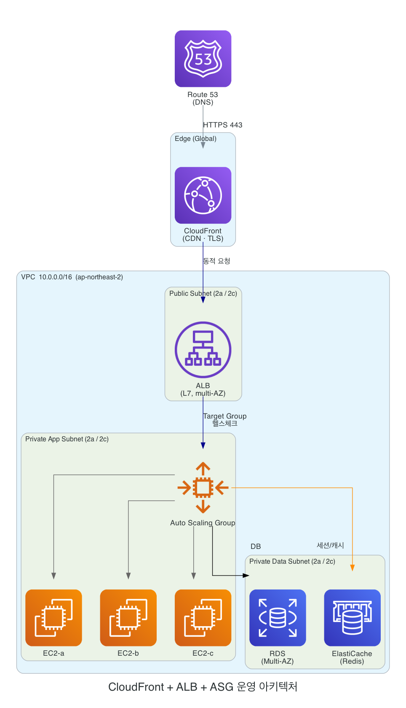

# 실전 시스템 아키텍처 설계 — CloudFront + ALB + ASG 운영 환경 구축

> **이 문서의 목적**
> 학습용 ASG+ALB 구성에서 한 발 더 나아가, **실제 운영(Production) 환경에서 돌릴 수 있는** 시스템 아키텍처를
> 컴포넌트별 역할 → 네트워크(VPC) 설계 → 요청 흐름 → 보안 → 오토 스케일링 → 무중단 배포 → 모니터링/비용 순서로
> 구체적으로 설계한다.
>
> 전제 워크로드: **"항상 떠 있는 HTTP 백엔드(예: Spring Boot REST API) + SPA 프론트엔드"** 형태의 일반 웹 서비스.
> *앞선 자료 [week5-1winhyun.md] 의 결론(학습·운영 모두 ASG+ALB가 정석)을 기반으로 한다.*

---

## 1. 전체 구성도

---

## 2. 컴포넌트별 역할과 설계 결정

### 2.1 Route 53 (DNS)
- 서비스 도메인(`api.example.com`, `www.example.com`)을 **CloudFront 배포로 Alias(A/AAAA) 레코드** 연결.
- Alias 레코드는 AWS 리소스를 가리킬 때 **쿼리 요금이 없고**, zone apex(루트 도메인)에도 사용 가능하다.
- 선택: 헬스 체크 + 장애 조치(failover) 라우팅으로 멀티 리전 DR까지 확장 가능(이번 설계 범위 밖, 단일 리전 기준).

### 2.2 CloudFront (CDN / 엣지)
- **진입점 단일화**: 모든 사용자 트래픽이 CloudFront를 먼저 통과한다.
- **TLS 종료**: HTTPS 인증서는 **반드시 `us-east-1`(버지니아 북부) 리전의 ACM 인증서**여야 한다. (CloudFront의 제약 사항 — 다른 리전 인증서는 연결 불가)
- **오리진(Origin) 2개 구성 (Behavior 기반 라우팅)**:
  - `/*` (기본, 동적 요청) → **ALB 오리진**
  - `/static/*`, 이미지/JS/CSS → **S3 오리진**
- **캐시 정책(Cache Policy) / 오리진 요청 정책(Origin Request Policy)**:
  - 정적 자산: 길게 캐시(`max-age` 크게), 쿼리스트링/쿠키 제외.
  - API: 보통 `CachingDisabled` 관리형 정책 사용. 단, `GET` 중 캐시 가능한 것만 짧은 TTL로 선별 캐시.
  - **주의**: `Authorization` 헤더·쿠키가 필요한 API는 오리진 요청 정책에서 해당 헤더를 명시적으로 포워딩해야 한다(기본 캐시 정책은 대부분 헤더를 떨어뜨린다).

### 2.3 ALB (Application Load Balancer)
- **public subnet에 배치**, 최소 2개 AZ의 서브넷에 걸쳐 생성(ALB 요구사항: 서로 다른 AZ의 서브넷 2개 이상).
- **리스너**: 443(HTTPS) 리스너. 인증서는 **ALB와 같은 리전**의 ACM 인증서 사용(CloudFront 인증서와 별개).
  - CloudFront→ALB 구간도 HTTPS로 암호화(Origin Protocol Policy: HTTPS only) → 종단 간 암호화.
- **대상 그룹(Target Group)**: ASG가 자동 등록. 헬스 체크 경로는 앱 전용 엔드포인트(예: `/actuator/health`)로 설정.
- **라우팅 규칙(선택)**: `/api/*`, `/admin/*` 등 경로 기반 분기 가능.

### 2.4 Auto Scaling Group (EC2)
- **private subnet에 배치** (인터넷에서 직접 접근 불가 → ALB를 통해서만 트래픽 수신).
- **다중 AZ**(예: ap-northeast-2a, 2c) 분산.
- **Launch Template**으로 인스턴스 정의(AMI, 인스턴스 타입, IAM 인스턴스 프로파일, user data, 보안 그룹).
- **용량**: `min` / `desired` / `max` 설정 (예: min 2 / desired 2 / max 6 — 운영은 min 2 이상으로 AZ 장애 대비).
- **헬스 체크**: **ELB health check 활성화** → 앱이 죽은 좀비 인스턴스를 ASG가 교체.
- **무상태 원칙**: 세션·파일 업로드 등 상태는 EC2 로컬에 저장하지 않는다(아래 2.5/2.6).

### 2.5 RDS (관계형 DB)
- **private subnet**, **Multi-AZ 배포**로 standby 복제본 자동 장애 조치.
- 읽기 부하가 크면 **Read Replica** 추가로 읽기 분산(쓰기는 primary).
- EC2 보안 그룹에서 오는 트래픽만 DB 포트(예: 3306/5432) 허용.

### 2.6 ElastiCache (Redis) — 세션/캐시
- 수평 확장된 여러 EC2가 **세션을 공유**해야 하므로 세션 저장소를 외부로 분리(Spring Session + Redis 등).
- 또는 ALB **Sticky Session**으로 우회 가능하나, 인스턴스 교체/스케일 인 시 세션 유실 위험이 있어 운영에선 외부 세션 저장소를 권장.
- DB 앞단 캐시로도 활용해 RDS 부하·지연 감소.

### 2.7 S3 — 정적 자산 / 업로드 파일
- 프론트엔드 빌드 산출물, 이미지 등 정적 콘텐츠 저장.
- **OAC(Origin Access Control)** 로 S3 버킷을 비공개로 두고 **CloudFront를 통해서만** 접근 허용(버킷 퍼블릭 노출 금지).
  - *참고: 과거의 OAI(Origin Access Identity)는 레거시이며, 현재 AWS는 OAC 사용을 권장.*

### 2.8 NAT Gateway
- private subnet의 EC2가 **아웃바운드**(패키지 업데이트, 외부 API 호출 등)를 할 수 있게 함.
- 인바운드는 허용하지 않음(외부에서 EC2로 직접 진입 불가 유지).
- **AZ별로 NAT Gateway를 두는 것이 가용성·데이터 전송 비용 면에서 권장**(단일 NAT는 그 AZ 장애 시 전체 아웃바운드 영향).

---

## 3. 네트워크(VPC) 설계

예시 CIDR: `10.0.0.0/16`, 2개 AZ(ap-northeast-2a / 2c) 기준.

| 서브넷 | AZ | CIDR(예) | 용도 | 인터넷 경로 |
|---|---|---|---|---|
| public-a | 2a | 10.0.0.0/24 | ALB, NAT GW | Internet Gateway |
| public-c | 2c | 10.0.1.0/24 | ALB, NAT GW | Internet Gateway |
| private-app-a | 2a | 10.0.10.0/24 | EC2 (ASG) | NAT GW (아웃바운드만) |
| private-app-c | 2c | 10.0.11.0/24 | EC2 (ASG) | NAT GW (아웃바운드만) |
| private-data-a | 2a | 10.0.20.0/24 | RDS, ElastiCache | 없음(격리) |
| private-data-c | 2c | 10.0.21.0/24 | RDS, ElastiCache | 없음(격리) |

- **3계층(웹/앱/데이터) 분리**: public(ALB) → private-app(EC2) → private-data(DB)로 단계적으로 격리.
- **Internet Gateway**: public subnet에만 라우팅 연결.
- **라우팅 테이블**: public은 `0.0.0.0/0 → IGW`, private-app은 `0.0.0.0/0 → NAT GW`, private-data는 외부 경로 없음.

---

## 4. 보안 설계

### 4.1 보안 그룹(Security Group) 체이닝
방화벽을 "출발지 = 특정 SG"로 연결해 IP가 바뀌어도 규칙이 유지되도록 한다.

| SG | 인바운드 허용 | 출발지 |
|---|---|---|
| `sg-cloudfront-alb` (ALB) | 443 | **CloudFront 관리형 prefix list** + (선택) 0.0.0.0/0 |
| `sg-ec2` (EC2) | 8080(앱 포트) | `sg-alb` 만 |
| `sg-rds` (RDS) | 3306/5432 | `sg-ec2` 만 |
| `sg-redis` (ElastiCache) | 6379 | `sg-ec2` 만 |

### 4.2 ALB를 CloudFront 뒤로 숨기기 (오리진 보호) — 중요
ALB가 인터넷에 열려 있으면 CloudFront를 우회해 직접 공격당할 수 있다. 두 가지 방법:

- **방법 A (권장, 전통적):** ALB 보안 그룹 인바운드를 **AWS 관리형 prefix list `com.amazonaws.global.cloudfront.origin-facing`** 로 제한 → CloudFront 엣지에서 오는 트래픽만 허용.
  - 추가로 **CloudFront에 비밀 커스텀 헤더**(예: `X-Origin-Verify: <secret>`)를 주입하고, ALB 리스너 규칙에서 그 헤더가 없으면 403 반환 → prefix list만으로 부족한 부분(같은 prefix를 쓰는 타 계정 CloudFront)을 보강.
- **방법 B (최신):** **CloudFront VPC Origins** 기능을 사용하면 **private subnet의 ALB**를 인터넷 노출 없이 직접 오리진으로 지정 가능.
  - *참고: VPC Origins는 비교적 최근(2024년 11월) 추가된 기능이다. 사용 전 해당 리전 지원 여부와 제약을 확인할 것.*

---

## 5. 오토 스케일링 정책 설계

| 항목 | 설계값(예시) | 근거 |
|---|---|---|
| 기본 정책 | **Target Tracking** — 평균 CPU 50% 유지 또는 `ALBRequestCountPerTarget` 기준 | AWS 권장 출발점, 트래픽 비례 |
| 최소 용량(min) | 2 | AZ 1개 장애 시에도 서비스 지속 |
| 최대 용량(max) | 6 (워크로드에 맞게) | 비용 상한 안전장치 |
| 보조 정책 | 예측 가능한 피크엔 **Scheduled**, 패턴 학습형엔 **Predictive(Forecast and scale)** | 반응형의 "지각 도착" 보완 |
| 워밍업 | Launch Template + **인스턴스 워밍업 시간** 설정 | 부팅·앱 기동 중인 인스턴스를 지표에서 제외 |
| 헬스 체크 | ELB health check + grace period 적절히 | 앱 기동 전 조기 교체 방지 |

> 반응형(Target Tracking)은 지표가 오른 뒤 반응 + 부팅 워밍업 지연이 있으므로, **트래픽 급증이 예측되면 Scheduled/Predictive로 미리 확장**하는 그림을 같이 둔다. (상세: [week5-1winhyun.md] 2.2절)

---

## 6. 무중단 배포 설계

ASG + ALB 위에서 선택지:

- **ASG Instance Refresh (Rolling)**: 새 Launch Template 버전으로 인스턴스를 일정 비율씩 교체. `MinHealthyPercentage`로 가용 용량 유지. 간단한 롤링 배포.
- **AWS CodeDeploy Blue/Green**: 새 ASG(Green)를 통째로 띄워 헬스 통과 후 **ALB 대상 그룹을 전환**, 문제 시 즉시 롤백. 운영에서 가장 안전.
- 공통 안전장치: **연결 드레이닝(deregistration delay)**, 헬스 체크 기반 전환 판단.
- CloudFront 캐시 주의: 프론트엔드 배포 시 **버전드 파일명(해시) 사용**으로 캐시 무효화 비용 최소화, 필요한 경로만 **Invalidation**.

> 무중단 배포 상세는 별도 자료에서 깊게 다룬다(키워드: Instance Refresh, CodeDeploy, Canary, Target Group 전환).

---
