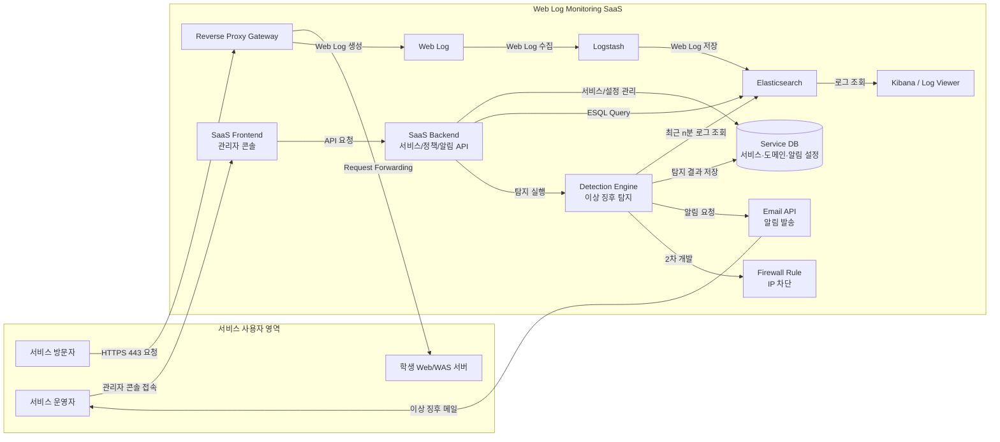
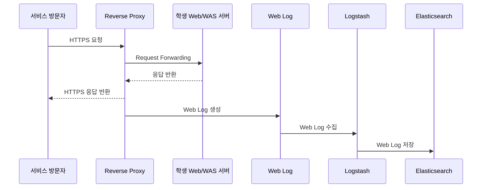
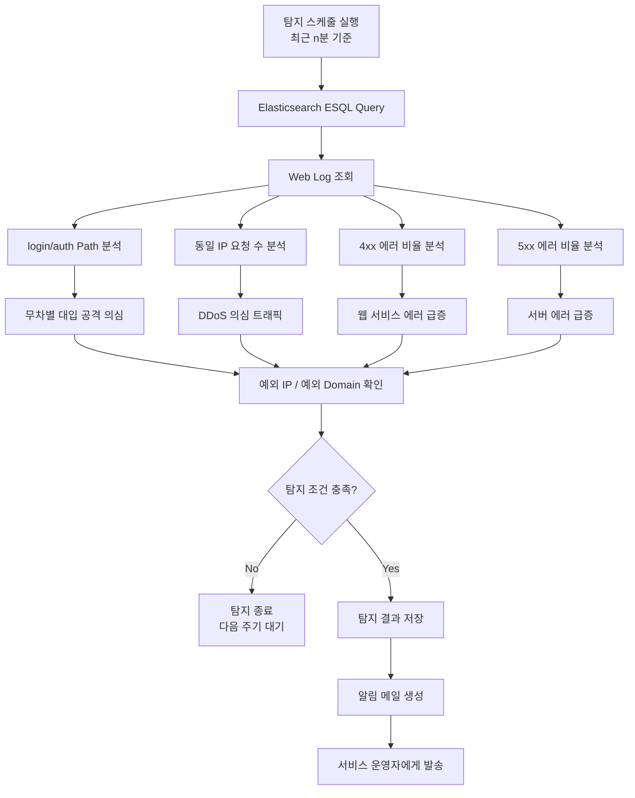
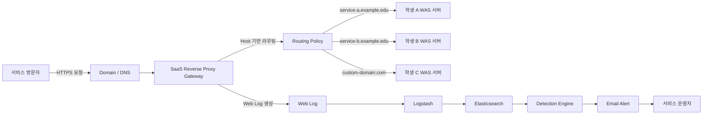
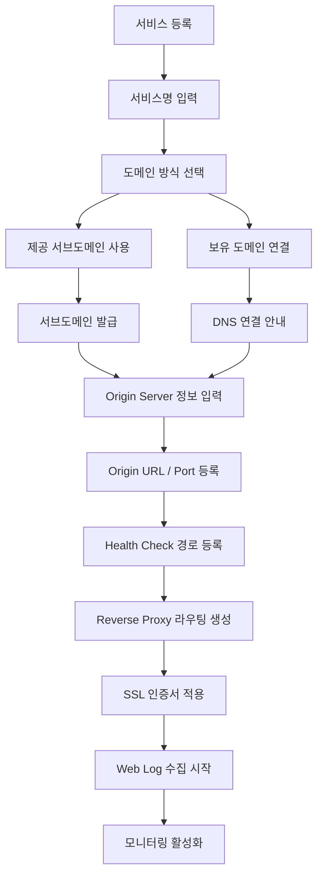
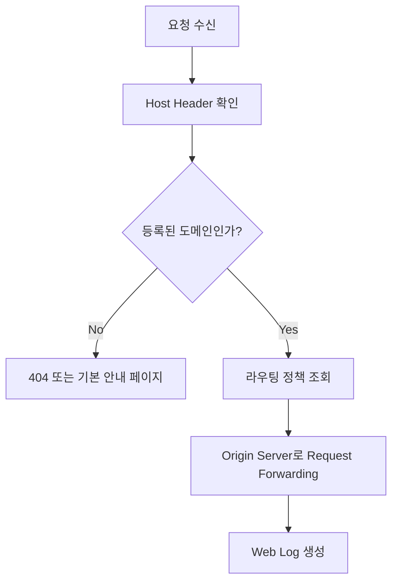
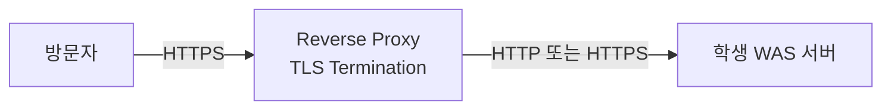
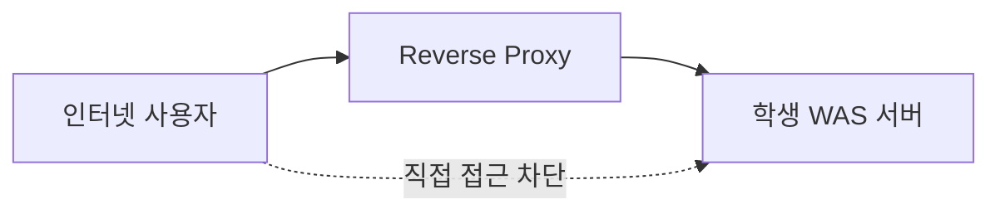
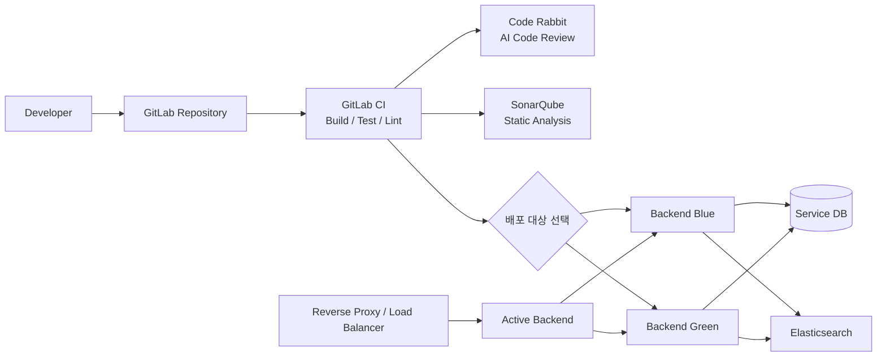

# Web Log 기반 이상 징후 탐지·대응 SaaS 개발 계획서

## 1. 서비스 개요

본 서비스는 교내 학생들이 운영하는 사이드 프로젝트 앞단에 **Reverse Proxy Gateway**를 제공하고, 해당 프록시에서 발생하는 Web Log를 수집·분석하여 비정상적인 트래픽, 인증 공격, DDoS 의심 요청, 웹 서비스 오류, 서버 오류를 탐지하는 **웹 로그 모니터링 SaaS**이다.

서비스 사용자는 별도의 로그 분석 인프라를 직접 구축하지 않아도, 자신의 웹서비스를 등록하고 도메인과 WAS 서버 정보를 연결하는 것만으로 다음 기능을 사용할 수 있다.

- Reverse Proxy 기반 서비스 연결
- 도메인 연결
- SSL 인증서 적용 및 갱신
- HTTP -> HTTPS 강제 리다이렉션
- WAS 서버 헤더 정보 노출 차단
- Web Log 수집 및 저장
- Elasticsearch 기반 로그 조회
- 이상 징후 탐지
- 이메일 알림
- 제한적 자동 대응

첨부 요구서 기준 핵심 탐지 기능은 무차별 대입 공격 탐지, 동일 IP 기준 DDoS 탐지, 4xx/5xx 에러 급증 탐지, 알림 메일 발신, 그리고 2차 개발 범위인 방화벽 인바운드 차단 IP 등록이다.

## 2. 서비스 대상

### 주요 사용자

- 교내에서 사이드 프로젝트를 운영 중인 학생
- 자체 웹서비스를 배포했지만 모니터링 체계가 부족한 개발자
- 서버 로그를 직접 분석하기 어려운 서비스 운영자
- 도메인, SSL, HTTPS, Reverse Proxy 운영을 간편하게 위임하고 싶은 사용자
- 장애 원인 분석과 비정상 트래픽 탐지가 필요한 프로젝트 팀

## 3. 전체 Architecture

### 3.1 SaaS 전체 아키텍처



### 3.2 요청 처리 및 로그 수집 흐름



### 3.3 이상 징후 탐지 흐름



## 4. 교내 학생 사이드 프로젝트 대상 Reverse Proxy 제공 방식

### 4.1 제공 개념

본 SaaS는 교내 학생들의 사이드 프로젝트 앞단에 **공용 Reverse Proxy Gateway**를 제공한다.

학생은 자신의 WAS 서버를 직접 외부에 노출하지 않고, SaaS에 서비스 정보를 등록한 뒤 제공받은 서브도메인 또는 보유 도메인을 연결한다. 이후 외부 사용자의 요청은 Reverse Proxy를 먼저 거치고, Reverse Proxy는 등록된 서비스의 WAS 서버로 요청을 전달한다.



### 4.2 서비스 등록 흐름



### 4.3 도메인 제공 방식

#### 1) 제공 서브도메인 방식

학생이 별도 도메인을 구매하지 않은 경우 SaaS가 서브도메인을 제공한다.

```text
원하는이름.service-domain.com
```

예시:

```text
portfolio.service-domain.com
festival-api.service-domain.com
team-alpha.service-domain.com
```

처리 흐름은 다음과 같다.

1. 학생이 원하는 서브도메인 이름을 입력한다.
2. SaaS가 중복 여부를 확인한다.
3. 사용 가능한 이름이면 서비스에 서브도메인을 할당한다.
4. Reverse Proxy에 Host 기반 라우팅을 등록한다.
5. SSL 인증서를 발급하거나 Wildcard 인증서를 적용한다.
6. 해당 도메인으로 들어온 요청을 학생의 WAS 서버로 전달한다.

#### 2) 사용자 보유 도메인 연결 방식

학생이 이미 구매한 도메인이 있는 경우 해당 도메인을 SaaS Reverse Proxy에 연결할 수 있다.

예시:

```text
myproject.com
api.myproject.com
```

DNS 연결 방식은 다음과 같다.

| 방식 | 설명 |
| --- | --- |
| CNAME 방식 | `api.myproject.com` -> SaaS Gateway Domain |
| A Record 방식 | `myproject.com` -> Reverse Proxy 서버 IP |
| TXT 인증 | 도메인 소유 확인용 토큰 등록 |

### 4.4 WAS 서버 연결 방식

학생의 사이드 프로젝트는 EC2, 개인 서버, 클라우드 VM, 컨테이너 서버 등에서 실행될 수 있다. SaaS는 해당 WAS 서버를 **Origin Server**로 등록한다.

| 항목 | 설명 |
| --- | --- |
| 서비스명 | 콘솔에서 구분할 이름 |
| 도메인 | 제공 서브도메인 또는 사용자 보유 도메인 |
| Origin URL | 실제 WAS 서버 주소 |
| Origin Port | WAS가 열어둔 포트 |
| Protocol | HTTP 또는 HTTPS |
| Health Check Path | `/health`, `/api/health` 등 |
| 알림 이메일 | 이상 징후 발생 시 수신자 |
| 예외 IP | 탐지 또는 차단에서 제외할 IP |
| 예외 Domain | 탐지에서 제외할 도메인 |

### 4.5 Reverse Proxy 라우팅 정책

Reverse Proxy는 요청의 `Host` 값을 기준으로 어떤 학생 서비스로 전달할지 결정한다.

| 요청 도메인 | 전달 대상 |
| --- | --- |
| `portfolio.service-domain.com` | 학생 A WAS |
| `festival.service-domain.com` | 학생 B WAS |
| `api.myproject.com` | 학생 C WAS |



### 4.6 SSL 및 HTTPS 제공

SaaS는 학생 서비스 앞단에서 HTTPS를 제공한다.

- SSL 인증서 발급
- SSL 인증서 자동 갱신
- HTTP 요청을 HTTPS로 강제 리다이렉션
- HSTS Header 적용
- TLS 종료 지점 제공



### 4.7 WAS 서버 보호 정책

학생의 WAS 서버가 직접 노출되는 것을 줄이기 위해 Reverse Proxy 단계에서 기본 보호 정책을 제공한다.

- WAS 서버 헤더 정보 노출 차단
- `Server` Header 제거 또는 변조
- `X-Powered-By` Header 제거
- HTTP -> HTTPS 리다이렉션
- HSTS 적용
- 비정상 요청 로그 기록
- 과도한 요청 탐지
- 악성 IP 후보 탐지
- 예외 IP 관리
- 필요 시 인바운드 차단 연계

권장 구성은 다음과 같다.



| 항목 | 권장 정책 |
| --- | --- |
| WAS Public Port | 최소화 |
| 방화벽 | Reverse Proxy IP만 허용 |
| 관리자 포트 | 외부 공개 금지 |
| DB 포트 | 외부 공개 금지 |
| SSH | 특정 IP만 허용 |
| 로그 | Reverse Proxy 기준으로 수집 |

## 5. Blue/Green 배포 아키텍처



# 주차별 개발 계획

## Week 2. 아키텍처 및 마일스톤 확정

- SaaS 서비스 구조 확정
- 전체 아키텍처 설계
- Reverse Proxy 제공 방식 설계
- 사용자 서비스 등록 흐름 정의
- 도메인 연결 방식 정의
- 1차 / 2차 개발 범위 분리
- 탐지 규칙 초안 작성
- 주차별 개발 마일스톤 확정

## Week 3. GitLab 및 기본 인프라 구축

- Node.js + TypeScript 기반 탐지 서비스 구조 구성
- Elasticsearch ES|QL 기반 Web Log 조회 클라이언트 구현
- 1분 단위 폴링 실행 구조 구성
- 모니터링 시나리오 구현을 위한 Elasticsearch, Kibana, Logstash 세팅

## Week 4. CI/CD 및 모니터링 구축

- CI/CD 전체 구축
- CD는 Blue/Green 방식으로 구성
- 프런트엔드-백엔드 API 연동
- 도메인 연결 기능 구현
- Reverse Proxy 라우팅 생성 기능 구현
- SSL 인증서 적용 방식 정리
- Reverse Proxy Web Log를 Logstash로 수집하는 흐름 정리
- Elasticsearch 인덱스 및 필드 매핑 검증
- Kibana 기반 로그 조회 화면 및 대시보드 구성
- 탐지 결과 저장 구조 설계
- 서비스별 알림 정책 연동
- 운영 콘솔에서 로그 조회 및 탐지 결과 확인 기능 구현

## Week 5. Code Rabbit 및 AI 경고/알람 추가

- Code Rabbit 도입 및 연동
- SonarQube 정적 분석 연동
- 탐지 결과 요약용 AI 구조 설계
- Gemini 또는 Codex + Vector 연동 검토
- 이상 징후 요약 메시지 생성
- 서비스별 알림 정책 구현
- 알림 메일 템플릿 개선

## Week 6. 제한적 초동 조치 AI 추가

- Qwen 또는 Ollama 실행 환경 구성
- 자동 대응 가능 범위 정의
- 탐지 IP 차단 후보 분류
- 예외 IP 보호 로직 구현
- 방화벽 인바운드 차단 IP 등록 기능 구현
- 일정 시간 이후 차단 자동 해제 구현
- 자동 조치 이력 저장
- 오탐 방지 규칙 작성

## Week 7. 전체 QA 및 확장 검토

- 전체 QA 진행
- 서비스 등록 테스트
- 도메인 연결 테스트
- Reverse Proxy 라우팅 테스트
- SSL 인증서 적용 테스트
- HTTPS 리다이렉션 테스트
- WAS 서버 헤더 정보 노출 차단 확인
- 로그 수집 테스트
- 탐지 규칙별 테스트
- 알림 메일 발신 테스트
- Blue/Green 배포 테스트
- 자동 차단 및 자동 해제 테스트
- 시간 남을 시 Kubernetes 또는 Terraform 추가 검토
