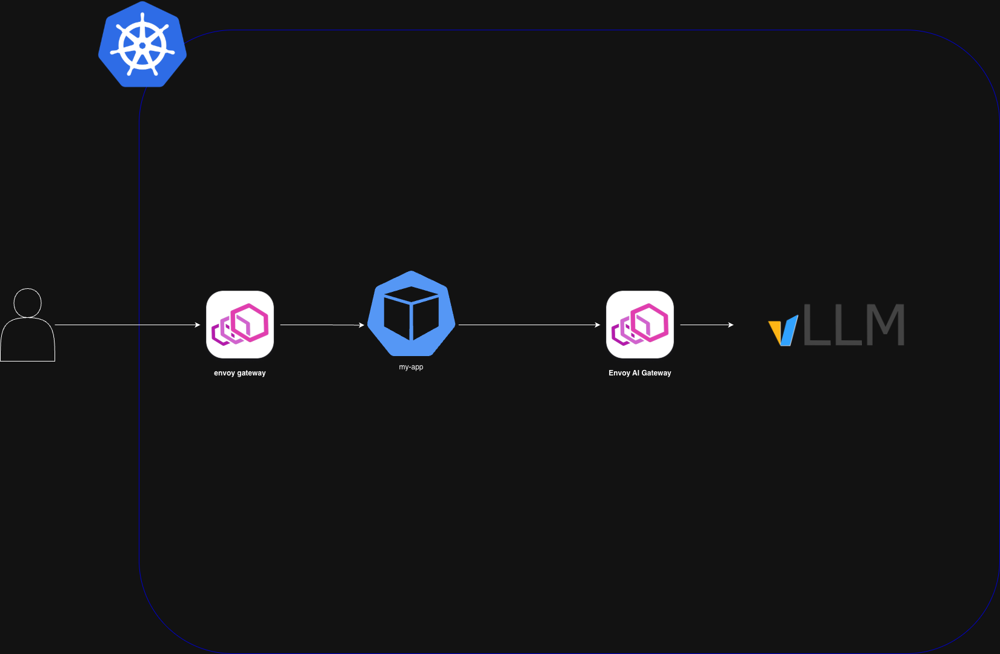

# 1주차

# 목표
- 쿠버네티스 Gateway API를 통한 배포, Envoy AI Gateway 배포
-  직접 사용하는 서비스 CI/CD 구축, gitlab runner 템플릿 기반으로 구축 진행
- AI Agent구축 배포 에이전트 구축 진행

# 아키텍처

- envoy gateway 아키텍처를 통해서 일반 서비스하고 통신
- envoy ai gateway를 통해서, LLM 서비스와 통신

# CI/CD 구축
- gitlab runner + argo cd 기반으로 CI/CD 구축

