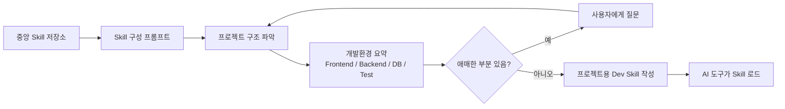
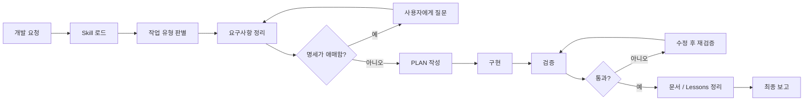
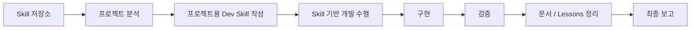
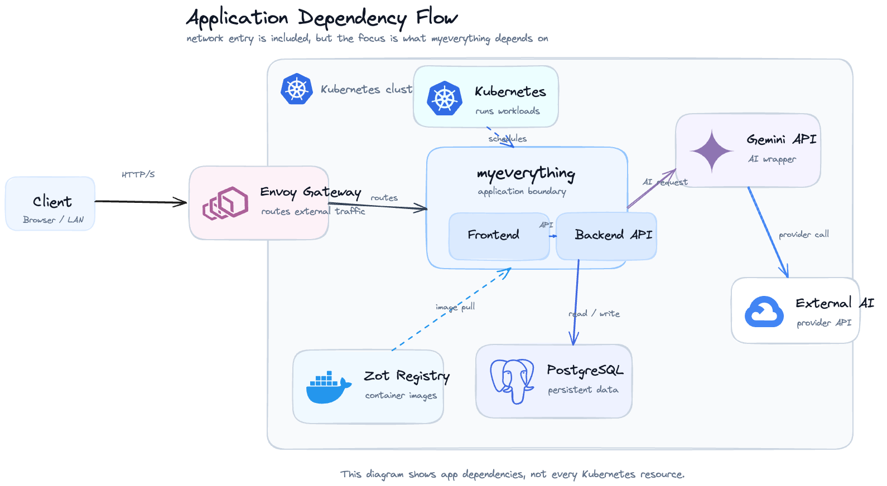

# 이번주 한일

1. 개발 루프 SKILLS로 만들기
2. 쿠버네티스 환경 정리
3. AI 개발 파이프라인 Flow 정리

# AI 개발 파이프라인 Flow

## Skill 구성 파이프라인

## 실제 개발 작업 루프

## 전체 흐름 요약

# 쿠버네티스 환경 정리

## 아키텍처

- Excalidraw: [kubernetes-icon-flow-horizontal.excalidraw](./kubernetes-icon-flow-horizontal.excalidraw)
- PNG: [application-dependency-flow.png](./application-dependency-flow.png)
- 목적: 쿠버네티스 리소스 단위가 아니라 애플리케이션이 어떤 컴포넌트에 의존하는지 중심으로 정리

## 주요 구성

| 구성 | 역할 |
|---|---|
| Envoy Gateway | 외부 HTTP/S 트래픽 진입점 |
| myeverything | 프론트엔드와 백엔드 API를 포함한 핵심 애플리케이션 |
| PostgreSQL | 애플리케이션 영속 데이터 저장소 |
| Gemini API wrapper | AI 요청을 외부 AI provider로 중계 |
| Zot Registry | 컨테이너 이미지 저장소 |
| Kubernetes | 워크로드 실행과 스케줄링 담당 |

## 의존성 요약

- 외부 사용자는 `Envoy Gateway`를 통해 `myeverything`에 접근한다.
- `myeverything`의 백엔드 API는 `PostgreSQL`에 데이터를 읽고 쓴다.
- AI 기능은 `Gemini API wrapper`를 거쳐 외부 AI provider에 요청한다.
- 배포 이미지는 `Zot Registry`에서 가져온다.
- 쿠버네티스는 애플리케이션 워크로드를 실행하고 스케줄링한다.
