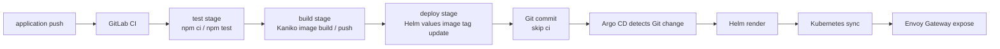

# 이번주 한 일

이번 주에는 GitLab CI/CD Component 기반의 공통 파이프라인을 구성하고, Argo CD를 이용한 GitOps 배포 흐름을 정리했습니다.

1. GitLab CI/CD Component 구성
2. 애플리케이션 공통 Pipeline 구성
3. Argo CD 구축 및 ApplicationSet 등록
4. GitLab CI와 Argo CD를 연결한 전체 CI/CD 흐름 정리

## 1. GitLab CI 사용 방법

이번 구성에서는 CI/CD 로직을 애플리케이션 repository에 직접 넣지 않고, 재사용 가능한 Component와 공통 Pipeline repository로 분리했습니다.

```text
cicd-test/
├── cicd-component/        # 재사용 가능한 GitLab CI/CD Component
├── cicd-pipeline/         # 애플리케이션에서 공통으로 사용하는 ci.yml
├── application/           # 실제 Node.js 애플리케이션
│   └── deploy/
│       ├── argocd/        # Argo CD ApplicationSet
│       └── helm/          # Kubernetes 배포용 Helm chart
├── vendor/helm/argo-cd/   # Argo CD Helm chart vendor 파일
├── values-cluster.yaml    # 현재 클러스터용 Argo CD Helm values
└── cicd-components-inputs.md
```

### Repository 역할

| repository | 역할 |
| --- | --- |
| `cicd-component` | 재사용 가능한 CI job Component 정의 |
| `cicd-pipeline` | 실제 애플리케이션에서 사용할 공통 `ci.yml` 제공 |
| `application` | 애플리케이션 코드와 배포 manifest 보관 |

`application` repository에는 자체 `.gitlab-ci.yml`을 두지 않고, GitLab 프로젝트 설정에서 `CI/CD configuration file`을 아래처럼 지정했습니다.

```text
ci.yml@example-group/cicd-pipeline/cicd-pipeline
```

이렇게 하면 `application`에 push가 발생했을 때 GitLab은 `cicd-pipeline` repository의 `ci.yml`을 읽고, job은 `application` repository의 소스 코드 기준으로 실행합니다.

### CI/CD Component 구성

`cicd-component/templates`에는 공통으로 재사용할 Component를 정의했습니다.

참고한 GitLab 공식 문서:

- [CI/CD components](https://docs.gitlab.com/ci/components/)
- [CI/CD inputs](https://docs.gitlab.com/ci/yaml/inputs/)
- [CI/CD input examples](https://docs.gitlab.com/ci/inputs/examples/)
- [Use CI/CD configuration from other files](https://docs.gitlab.com/ci/yaml/includes/)

| 파일 | 역할 |
| --- | --- |
| `hello.yml` | Component 동작 확인용 최소 예제 |
| `node-test.yml` | Node.js 의존성 설치 및 테스트 실행 |
| `kaniko-build.yml` | Kaniko로 Docker image build/push |

Component는 `spec:inputs`로 필요한 값을 선언하고, 사용하는 쪽에서 `inputs`를 넘기는 방식으로 구성했습니다.

```yaml
include:
  - component: $CI_SERVER_FQDN/example-group/cicd-component/cicd-component/node-test@main
    inputs:
      job-name: test-application
      stage: test
      runner-tag: cicd
      node-image: node:22-alpine
      install-command: npm ci
      test-command: npm test
```

운영 환경에서는 `@main` 대신 `@v0.1.0` 같은 tag로 고정하는 것이 좋습니다. 그래야 Component 변경이 애플리케이션 파이프라인에 즉시 영향을 주지 않습니다.

### 공통 Pipeline 구성

`cicd-pipeline/ci.yml`은 `application` repository에서 실행될 공통 파이프라인입니다.

```yaml
stages:
  - test
  - build
  - deploy
```

현재 job 구성은 아래와 같습니다.

| stage | job | 설명 |
| --- | --- | --- |
| `test` | `test-application` | `npm ci`, `npm test` 실행 |
| `build` | `build-and-push-application-image` | Kaniko로 Docker image build 후 registry push |
| `deploy` | `update-helm-image-tag` | Helm values의 image tag를 commit SHA로 갱신 후 push |

이미지 저장소는 Zot Registry를 사용하도록 설정했습니다.

```yaml
APP_IMAGE_REPOSITORY: registry.example.com/example-project/application
```

Kaniko build job은 기본적으로 아래 두 tag를 push합니다.

```text
registry.example.com/example-project/application:$CI_COMMIT_SHORT_SHA
registry.example.com/example-project/application:latest
```

### Deploy stage 구성

`update-helm-image-tag` job은 기본 branch에서만 실행됩니다.

이 job은 `application/deploy/helm/application/values.yaml` 파일의 image 정보를 갱신합니다.

```yaml
image:
  repository: registry.example.com/example-project/application
  tag: <CI_COMMIT_SHORT_SHA>
```

변경이 있으면 아래 형식의 commit을 생성하고 다시 `application` repository에 push합니다.

```text
chore(deploy): update image tag to <commit-sha> [skip ci]
```

`[skip ci]`를 넣는 이유는 image tag 갱신 commit 때문에 파이프라인이 다시 무한 반복되는 것을 막기 위해서입니다.

이 job이 push하려면 `application` GitLab 프로젝트에 아래 CI/CD 변수가 필요합니다.

```text
DEPLOY_PUSH_TOKEN
```

권장 값은 `write_repository` 권한을 가진 Project Access Token입니다. GitLab 변수에서는 masked/protected 설정을 권장합니다.

### Runner 설정

현재 job들은 `cicd` tag를 가진 Kubernetes executor runner에서 실행되도록 구성했습니다.

```text
runner tag: cicd
executor: kubernetes
```

따라서 Component input이나 job 정의에는 아래처럼 runner tag가 들어갑니다.

```yaml
tags:
  - cicd
```

## 2. Argo CD 배포 연동

### ApplicationSet 등록

애플리케이션 배포는 Argo CD `ApplicationSet`으로 관리합니다.

```text
application/deploy/argocd/applicationset.yaml
```

ApplicationSet은 `application` Argo CD Application을 생성하고, `deploy/helm/application` Helm chart를 바라보게 합니다.

```yaml
generators:
  - list:
      elements:
        - name: application
          namespace: application
          repoURL: https://gitlab.example.com/example-group/application.git
          targetRevision: main
          path: deploy/helm/application
          releaseName: application
```

최초 1회 아래 명령으로 등록합니다.

```bash
kubectl apply -f application/deploy/argocd/applicationset.yaml
```

### 자동 Sync 정책

ApplicationSet으로 생성되는 Application은 자동 sync를 사용합니다.

```yaml
syncPolicy:
  automated:
    prune: true
    selfHeal: true
  syncOptions:
    - CreateNamespace=true
```

| 옵션 | 설명 |
| --- | --- |
| `automated` | Git 변경 감지 시 자동 배포 |
| `prune: true` | Git에서 삭제된 리소스를 클러스터에서도 삭제 |
| `selfHeal: true` | 클러스터 상태가 Git과 달라지면 자동 복구 |
| `CreateNamespace=true` | 대상 namespace가 없으면 자동 생성 |

### 애플리케이션 Helm chart

애플리케이션은 Helm chart로 배포합니다.

```text
application/deploy/helm/application/
├── Chart.yaml
├── values.yaml
└── templates/
    ├── namespace.yaml
    ├── deployment.yaml
    ├── service.yaml
    └── httproute.yaml
```

주요 배포 설정은 아래와 같습니다.

| 항목 | 값 |
| --- | --- |
| namespace | `application` |
| replica | `2` |
| service type | `ClusterIP` |
| container port | `3000` |
| health check | `/healthz` |
| public hostname | `application.example.com` |
| gateway | `gateway-system/public-gateway` |

애플리케이션도 Gateway API `HTTPRoute`로 외부에 노출합니다.

```yaml
httproute:
  enabled: true
  hostname: application.example.com
  parentRefs:
    - name: public-gateway
      namespace: gateway-system
      sectionName: https
```

## 3. CI/CD 전체 과정

이번 주 구성한 전체 배포 흐름은 GitLab CI가 검증과 이미지 생성을 담당하고, Argo CD가 Kubernetes 반영을 담당하는 구조입니다.



상세 순서는 아래와 같습니다.

1. 개발자가 `application` repository `main` branch에 push합니다.
2. GitLab이 `application` 프로젝트의 외부 CI 설정을 읽습니다.
3. `cicd-pipeline/ci.yml`이 실행됩니다.
4. `ci.yml`이 `cicd-component`의 `node-test`, `kaniko-build` Component를 include합니다.
5. `test` stage에서 `npm ci`, `npm test`를 실행합니다.
6. `build` stage에서 Kaniko가 Docker image를 build/push합니다.
7. `deploy` stage에서 Helm `values.yaml`의 `image.tag`를 commit SHA로 갱신합니다.
8. GitLab CI가 `values.yaml` 변경분을 `[skip ci]` commit으로 push합니다.
9. Argo CD가 Git 변경을 감지합니다.
10. Argo CD가 `deploy/helm/application` chart를 render하고 sync합니다.
11. Kubernetes에 `Deployment`, `Service`, `HTTPRoute`가 반영됩니다.
12. Envoy Gateway를 통해 `https://application.example.com`로 서비스가 노출됩니다.

요약하면 아래와 같습니다.

```text
GitLab CI: test -> build image -> push image -> update Helm values
Argo CD: watch Git -> render Helm chart -> sync Kubernetes
```

이 방식의 장점은 배포 상태를 Git 이력으로 추적할 수 있다는 점입니다. 어떤 image tag가 배포되었는지 `deploy/helm/application/values.yaml` 변경 이력으로 확인할 수 있고, Argo CD는 Git을 기준으로 클러스터 상태를 계속 맞춥니다.
